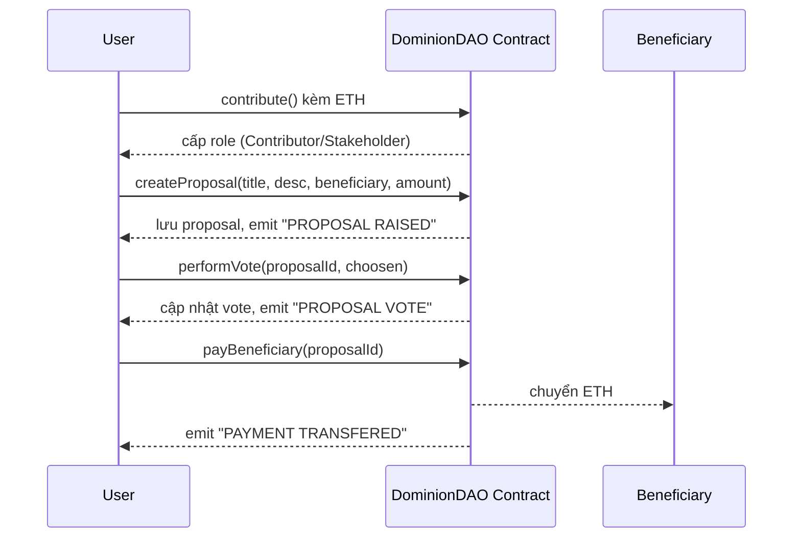

# DominionDAO – Quỹ DAO góp vốn, đề xuất & biểu quyết chi tiêu

Smart contract **DominionDAO** giúp tạo một quỹ chung (treasury) trên Ethereum.  
Người dùng có thể **góp ETH**, **trở thành Stakeholder** (khi góp đủ mức tối thiểu), **tạo đề xuất chi tiền**, **biểu quyết (vote)**, và **giải ngân** cho người thụ hưởng khi đề xuất được thông qua.

---

## ✨ Tính năng chính
- ✅ Góp quỹ bằng ETH (`contribute`)
- ✅ Tự cấp **role** dựa trên mức đóng góp:  
  - `CONTRIBUTOR`: đã từng góp > 0  
  - `STAKEHOLDER`: tổng góp **≥ 0.01 ETH**
- ✅ Tạo đề xuất chi tiền từ quỹ (`createProposal`) – chỉ **Stakeholder**
- ✅ Biểu quyết **upvote/downvote** (`performVote`) – chỉ **Stakeholder**
- ✅ Giải ngân cho beneficiary khi **upvotes > downvotes** (`payBeneficiary`) – chỉ **Stakeholder**
- ✅ Xem danh sách đề xuất, chi tiết đề xuất, lịch sử vote, số dư, v.v.

---

## ⚙️ Thông số quan trọng
- `MIN_STAKEHOLDER_CONTRIBUTION = 0.01 ether` – mức tối thiểu để trở thành Stakeholder
- `MIN_VOTE_DURATION = 5 minutes` – thời gian biểu quyết (mặc định test nhanh)
- `daoBalance` – số dư quỹ còn lại trong contract

---

## 🏗️ Luồng hoạt động chi tiết

### 1. Góp quỹ → cấp role

#### Chức năng `contribute()`
```solidity
function contribute() public payable
```

**Mô tả:** Người dùng gửi ETH vào quỹ DAO và tự động được cấp role dựa trên mức đóng góp.

**Luồng xử lý:**
1. Kiểm tra `msg.value > 0` (phải gửi ETH)
2. Cộng dồn `msg.value` vào `contributors[msg.sender]`
3. Cập nhật `daoBalance += msg.value`
4. Kiểm tra và cấp role:
   - Nếu `contributors[msg.sender] > 0`: cấp `CONTRIBUTOR_ROLE`
   - Nếu `contributors[msg.sender] >= 0.01 ETH`: cấp `STAKEHOLDER_ROLE`
5. Phát event "CONTRIBUTION RECEIVED"

**Ví dụ:**
```solidity
// Lần đầu góp 0.005 ETH
contribute{value: 0.005 ether}(); // → Nhận CONTRIBUTOR_ROLE

// Lần 2 góp thêm 0.008 ETH (tổng = 0.013 ETH)
contribute{value: 0.008 ether}(); // → Nhận thêm STAKEHOLDER_ROLE
```

**Các case có thể xảy ra:**
- ✅ Góp thành công → nhận role tương ứng
- ❌ Gửi 0 ETH → revert "Contribution must be greater than 0"
- ❌ Contract không đủ gas → transaction fail

---

### 2. Tạo đề xuất (Stakeholder)

#### Chức năng `createProposal()`
```solidity
function createProposal(
    string memory title,
    string memory description, 
    address payable beneficiary,
    uint256 amount
) public stakeholderOnly returns (uint256)
```

**Mô tả:** Stakeholder tạo đề xuất chi tiền từ quỹ DAO.

**Luồng xử lý:**
1. Kiểm tra caller có `STAKEHOLDER_ROLE`
2. Kiểm tra `amount > 0` và `amount <= daoBalance`
3. Kiểm tra `beneficiary != address(0)`
4. Tạo proposal mới với:
   - ID tự động tăng
   - Thời gian hết hạn = `block.timestamp + MIN_VOTE_DURATION`
   - Trạng thái ban đầu: `passed = false`, `paid = false`
5. Lưu vào mapping `proposals[proposalId]`
6. Phát event "PROPOSAL RAISED"

**Ví dụ:**
```solidity
// Stakeholder tạo đề xuất chi 1 ETH cho marketing
createProposal(
    "Marketing Campaign Q1 2024",
    "Chi phí quảng cáo Facebook, Google Ads cho sản phẩm mới",
    0x742d35Cc6634C0532925a3b8D4C9db96C4b4d8b6, // beneficiary
    1 ether // amount
);
// → Trả về proposalId = 1
```

**Các case có thể xảy ra:**
- ✅ Tạo thành công → trả về proposalId
- ❌ Không phải Stakeholder → revert "Only stakeholders can create proposals"
- ❌ Amount = 0 → revert "Amount must be greater than 0"
- ❌ Amount > daoBalance → revert "Insufficient DAO balance"
- ❌ Beneficiary = address(0) → revert "Invalid beneficiary address"

---

### 3. Biểu quyết (Stakeholder)

#### Chức năng `performVote()`
```solidity
function performVote(uint256 proposalId, bool choosen) public stakeholderOnly
```

**Mô tả:** Stakeholder vote upvote/downvote cho một proposal.

**Luồng xử lý:**
1. Kiểm tra caller có `STAKEHOLDER_ROLE`
2. Kiểm tra proposal tồn tại
3. Kiểm tra chưa hết hạn vote (`block.timestamp <= proposal.duration`)
4. Kiểm tra chưa vote trước đó
5. Cập nhật vote count:
   - `choosen = true` → `proposal.upvotes++`
   - `choosen = false` → `proposal.downvotes++`
6. Lưu thông tin vote vào `votes[proposalId]`
7. Phát event "PROPOSAL VOTE"

**Ví dụ:**
```solidity
// Vote upvote cho proposal ID 1
performVote(1, true);  // → upvotes++

// Vote downvote cho proposal ID 1 (sẽ fail vì đã vote)
performVote(1, false); // → revert "Already voted"
```

**Các case có thể xảy ra:**
- ✅ Vote thành công → cập nhật vote count
- ❌ Không phải Stakeholder → revert "Only stakeholders can vote"
- ❌ Proposal không tồn tại → revert "Proposal does not exist"
- ❌ Đã hết hạn vote → revert "Voting period has ended"
- ❌ Đã vote trước đó → revert "Already voted"

---

### 4. Giải ngân (Stakeholder)

#### Chức năng `payBeneficiary()`
```solidity
function payBeneficiary(uint256 proposalId) public stakeholderOnly
```

**Mô tả:** Stakeholder thực hiện giải ngân cho beneficiary nếu proposal thắng vote.

**Luồng xử lý:**
1. Kiểm tra caller có `STAKEHOLDER_ROLE`
2. Kiểm tra proposal tồn tại
3. Kiểm tra proposal chưa được trả (`!proposal.paid`)
4. Kiểm tra proposal đã thắng vote (`proposal.upvotes > proposal.downvotes`)
5. Kiểm tra quỹ còn đủ tiền (`proposal.amount <= daoBalance`)
6. Thực hiện chuyển tiền:
   - `daoBalance -= proposal.amount`
   - `proposal.beneficiary.transfer(proposal.amount)`
   - `proposal.paid = true`
7. Phát event "PAYMENT TRANSFERED"

**Ví dụ:**
```solidity
// Giải ngân cho proposal ID 1 (upvotes: 3, downvotes: 1)
payBeneficiary(1);
// → Chuyển 1 ETH đến beneficiary
// → daoBalance giảm 1 ETH
// → proposal.paid = true
```

**Các case có thể xảy ra:**
- ✅ Giải ngân thành công → chuyển ETH đến beneficiary
- ❌ Không phải Stakeholder → revert "Only stakeholders can execute"
- ❌ Proposal không tồn tại → revert "Proposal does not exist"
- ❌ Đã trả rồi → revert "Proposal already paid"
- ❌ Proposal thua vote → revert "Proposal did not pass"
- ❌ Quỹ không đủ tiền → revert "Insufficient DAO balance"
- ❌ Chuyển tiền thất bại → revert "Transfer failed"

---

## 🔄 Các kịch bản hoạt động

### Kịch bản 1: Luồng thành công hoàn chỉnh
```
1. Alice góp 0.02 ETH → trở thành Stakeholder
2. Alice tạo proposal chi 0.5 ETH cho Bob
3. Alice, Charlie, David (đều là Stakeholder) vote upvote
4. Eve (Stakeholder) vote downvote
5. Alice thực hiện payBeneficiary() → Bob nhận 0.5 ETH
```

### Kịch bản 2: Proposal thua vote
```
1. Alice tạo proposal chi 1 ETH
2. 2 người vote upvote, 3 người vote downvote
3. Alice gọi payBeneficiary() → revert "Proposal did not pass"
4. Proposal không được thực hiện
```

### Kịch bản 3: Quỹ không đủ tiền
```
1. DAO có 0.1 ETH
2. Alice tạo proposal chi 0.2 ETH
3. Proposal thắng vote (upvotes > downvotes)
4. Alice gọi payBeneficiary() → revert "Insufficient DAO balance"
```

### Kịch bản 4: Vote hết hạn
```
1. Alice tạo proposal (hết hạn sau 5 phút)
2. Sau 6 phút, Bob cố vote → revert "Voting period has ended"
3. Proposal không thể vote thêm
```

---

## 📦 Cấu trúc dữ liệu

### ProposalStruct
```solidity
struct ProposalStruct {
    uint256 id;
    uint256 amount;
    uint256 duration;
    uint256 upvotes;
    uint256 downvotes;
    string title;
    string description;
    bool passed;
    bool paid;
    address payable beneficiary;
    address proposer;
    address executor;
}
```

### VotedStruct
```solidity
struct VotedStruct {
    address voter;
    uint256 timestamp;
    bool choosen;
}
```

---

## 🔑 Vai trò & Quyền hạn (AccessControl)

- **CONTRIBUTOR_ROLE**: đã từng góp vào quỹ.
- **STAKEHOLDER_ROLE**: tổng góp ≥ 0.01 ETH.

### Modifiers:
- `stakeholderOnly`: chỉ Stakeholder được gọi.
- `contributorOnly`: chỉ Contributor được gọi.

---

## 📢 Events

```solidity
event Action(
    address indexed initiator,
    bytes32 role,
    string message,   // "PROPOSAL RAISED" | "PROPOSAL VOTE" | "PAYMENT TRANSFERED" | "CONTRIBUTION RECEIVED"
    address indexed beneficiary,
    uint256 amount
);
```

---

## 🛠️ Cài đặt & Triển khai (Hardhat)

### 1. Cài đặt
```bash
npm init -y
npm install --save-dev hardhat @nomicfoundation/hardhat-toolbox
npm install @openzeppelin/contracts@4.9.6
```

### 2. Cấu hình Hardhat (hardhat.config.js)
```js
require("@nomicfoundation/hardhat-toolbox");

module.exports = {
  solidity: {
    version: "0.8.19",
    settings: { optimizer: { enabled: true, runs: 200 } },
  },
  networks: {
    sepolia: {
      url: process.env.ALCHEMY_SEPOLIA_URL,
      accounts: [process.env.PRIVATE_KEY],
    },
  },
  etherscan: { apiKey: process.env.ETHERSCAN_API_KEY },
};
```

### 3. Biến môi trường .env
```ini
ALCHEMY_SEPOLIA_URL=https://eth-sepolia.g.alchemy.com/v2/XXXX
PRIVATE_KEY=0xYOUR_PRIVATE_KEY
ETHERSCAN_API_KEY=YOUR_KEY
```

### 4. Compile & Deploy
```bash
npx hardhat clean
npx hardhat compile
npx hardhat run scripts/deploy.js --network sepolia
```

### 5. Verify (tuỳ chọn)
```bash
npx hardhat verify --network sepolia <DEPLOYED_ADDRESS>
```

---

## 📖 API Contract chi tiết

### 🔄 Giao dịch (state-changing functions)

#### `contribute()` payable
```solidity
function contribute() public payable
```
**Chức năng:** Góp ETH vào quỹ DAO và tự động cấp role
**Quyền hạn:** Mọi người
**Ví dụ:**
```solidity
// Góp 0.01 ETH để trở thành Stakeholder
contribute{value: 0.01 ether}();
```

#### `createProposal()`
```solidity
function createProposal(
    string memory title,
    string memory description,
    address payable beneficiary, 
    uint256 amount
) public stakeholderOnly returns (uint256)
```
**Chức năng:** Tạo đề xuất chi tiền từ quỹ
**Quyền hạn:** Chỉ Stakeholder
**Ví dụ:**
```solidity
uint256 proposalId = createProposal(
    "Hackathon Prize",
    "Phần thưởng cho cuộc thi hackathon blockchain",
    0x1234...5678, // beneficiary address
    2 ether // amount
);
```

#### `performVote()`
```solidity
function performVote(uint256 proposalId, bool choosen) public stakeholderOnly
```
**Chức năng:** Vote upvote/downvote cho proposal
**Quyền hạn:** Chỉ Stakeholder
**Ví dụ:**
```solidity
performVote(1, true);  // Upvote proposal ID 1
performVote(1, false); // Downvote proposal ID 1
```

#### `payBeneficiary()`
```solidity
function payBeneficiary(uint256 proposalId) public stakeholderOnly
```
**Chức năng:** Giải ngân cho beneficiary nếu proposal thắng vote
**Quyền hạn:** Chỉ Stakeholder
**Ví dụ:**
```solidity
payBeneficiary(1); // Giải ngân cho proposal ID 1
```

---

### 👁️ View functions (read-only)

#### `getProposals()` 
```solidity
function getProposals() public view returns (ProposalStruct[] memory)
```
**Chức năng:** Lấy danh sách tất cả proposals
**Quyền hạn:** Mọi người
**Trả về:** Mảng các ProposalStruct
**Ví dụ:**
```solidity
ProposalStruct[] memory allProposals = getProposals();
console.log("Tổng số proposals:", allProposals.length);
```

#### `getProposal(uint256 id)`
```solidity
function getProposal(uint256 id) public view returns (ProposalStruct memory)
```
**Chức năng:** Lấy chi tiết một proposal cụ thể
**Quyền hạn:** Mọi người
**Tham số:** `id` - ID của proposal
**Ví dụ:**
```solidity
ProposalStruct memory proposal = getProposal(1);
console.log("Title:", proposal.title);
console.log("Amount:", proposal.amount);
console.log("Upvotes:", proposal.upvotes);
```

#### `getVotesOf(uint256 id)`
```solidity
function getVotesOf(uint256 id) public view returns (VotedStruct[] memory)
```
**Chức năng:** Lấy danh sách tất cả votes của một proposal
**Quyền hạn:** Mọi người
**Tham số:** `id` - ID của proposal
**Ví dụ:**
```solidity
VotedStruct[] memory votes = getVotesOf(1);
for(uint i = 0; i < votes.length; i++) {
    console.log("Voter:", votes[i].voter);
    console.log("Choice:", votes[i].choosen);
}
```

#### `getStakeholderVotes()`
```solidity
function getStakeholderVotes() public view returns (uint256[] memory)
```
**Chức năng:** Lấy danh sách proposal IDs mà caller đã vote
**Quyền hạn:** Chỉ Stakeholder
**Trả về:** Mảng các proposal IDs
**Ví dụ:**
```solidity
uint256[] memory votedProposals = getStakeholderVotes();
console.log("Đã vote cho", votedProposals.length, "proposals");
```

#### `getStakeholderBalance()`
```solidity
function getStakeholderBalance() public view returns (uint256)
```
**Chức năng:** Lấy số ETH mà caller đã góp (chỉ Stakeholder)
**Quyền hạn:** Chỉ Stakeholder
**Trả về:** Số wei đã góp
**Ví dụ:**
```solidity
uint256 balance = getStakeholderBalance();
console.log("Đã góp:", balance / 1e18, "ETH");
```

#### `getContributorBalance()`
```solidity
function getContributorBalance() public view returns (uint256)
```
**Chức năng:** Lấy số ETH mà caller đã góp (chỉ Contributor)
**Quyền hạn:** Chỉ Contributor
**Trả về:** Số wei đã góp
**Ví dụ:**
```solidity
uint256 balance = getContributorBalance();
console.log("Đã góp:", balance / 1e18, "ETH");
```

#### `isStakeholder()`
```solidity
function isStakeholder() public view returns (bool)
```
**Chức năng:** Kiểm tra caller có phải Stakeholder không
**Quyền hạn:** Mọi người
**Trả về:** `true` nếu là Stakeholder, `false` nếu không
**Ví dụ:**
```solidity
if (isStakeholder()) {
    console.log("Bạn là Stakeholder, có thể tạo proposal và vote");
} else {
    console.log("Bạn chưa phải Stakeholder");
}
```

#### `isContributor()`
```solidity
function isContributor() public view returns (bool)
```
**Chức năng:** Kiểm tra caller có phải Contributor không
**Quyền hạn:** Mọi người
**Trả về:** `true` nếu là Contributor, `false` nếu không
**Ví dụ:**
```solidity
if (isContributor()) {
    console.log("Bạn đã từng góp vào quỹ");
} else {
    console.log("Bạn chưa góp vào quỹ");
}
```

#### `getBalance()`
```solidity
function getBalance() public view returns (uint256)
```
**Chức năng:** Lấy số ETH mà caller đã góp (tổng cộng)
**Quyền hạn:** Mọi người
**Trả về:** Số wei đã góp
**Ví dụ:**
```solidity
uint256 totalContribution = getBalance();
console.log("Tổng đã góp:", totalContribution / 1e18, "ETH");
```

#### `daoBalance` (public variable)
```solidity
uint256 public daoBalance
```
**Chức năng:** Số dư quỹ hiện tại trong contract
**Quyền hạn:** Mọi người (public)
**Ví dụ:**
```solidity
uint256 currentBalance = daoBalance;
console.log("Quỹ DAO hiện có:", currentBalance / 1e18, "ETH");
```

---

## 🔍 Ví dụ sử dụng API

### Kiểm tra trạng thái DAO
```solidity
// Kiểm tra số dư quỹ
uint256 balance = daoBalance;
console.log("Quỹ DAO:", balance / 1e18, "ETH");

// Kiểm tra vai trò của mình
if (isStakeholder()) {
    console.log("Bạn là Stakeholder");
    uint256 myContribution = getStakeholderBalance();
    console.log("Đã góp:", myContribution / 1e18, "ETH");
} else if (isContributor()) {
    console.log("Bạn là Contributor");
    uint256 myContribution = getContributorBalance();
    console.log("Đã góp:", myContribution / 1e18, "ETH");
} else {
    console.log("Bạn chưa góp vào quỹ");
}
```

### Xem danh sách proposals
```solidity
// Lấy tất cả proposals
ProposalStruct[] memory proposals = getProposals();
console.log("Tổng số proposals:", proposals.length);

// Xem chi tiết từng proposal
for(uint i = 0; i < proposals.length; i++) {
    console.log("=== Proposal", proposals[i].id, "===");
    console.log("Title:", proposals[i].title);
    console.log("Amount:", proposals[i].amount / 1e18, "ETH");
    console.log("Upvotes:", proposals[i].upvotes);
    console.log("Downvotes:", proposals[i].downvotes);
    console.log("Paid:", proposals[i].paid);
    console.log("Duration:", proposals[i].duration);
}
```

### Xem lịch sử vote
```solidity
// Xem votes của proposal ID 1
VotedStruct[] memory votes = getVotesOf(1);
console.log("Proposal 1 có", votes.length, "votes");

for(uint i = 0; i < votes.length; i++) {
    console.log("Voter:", votes[i].voter);
    console.log("Choice:", votes[i].choosen ? "Upvote" : "Downvote");
    console.log("Time:", votes[i].timestamp);
}
```

---

## 🔄 Flow minh hoạ



---

## 🎯 Các trường hợp sử dụng thực tế

### 1. Quỹ cộng đồng dự án
```
Mục đích: Tập hợp vốn từ cộng đồng để phát triển dự án
- Người dùng góp ETH vào quỹ
- Stakeholder đề xuất chi tiền cho marketing, development
- Cộng đồng vote quyết định chi tiêu
- Tự động giải ngân khi proposal được thông qua
```

### 2. Quỹ đầu tư tập thể
```
Mục đích: Đầu tư chung vào các cơ hội
- Các nhà đầu tư góp vốn
- Đề xuất đầu tư vào startup, token, NFT
- Vote quyết định đầu tư
- Phân phối lợi nhuận cho các stakeholder
```

### 3. Quỹ từ thiện minh bạch
```
Mục đích: Quản lý quỹ từ thiện một cách minh bạch
- Nhà hảo tâm góp tiền
- Đề xuất chi tiêu cho các hoạt động từ thiện
- Cộng đồng vote chọn hoạt động
- Tự động chuyển tiền đến tổ chức từ thiện
```

---

## 🔒 Bảo mật & Rủi ro

### ✅ Các biện pháp bảo mật
- **Access Control**: Chỉ Stakeholder mới có thể tạo proposal và vote
- **Validation**: Kiểm tra đầy đủ input parameters
- **Reentrancy Protection**: Sử dụng OpenZeppelin ReentrancyGuard
- **Role-based**: Phân quyền rõ ràng theo mức đóng góp

### ⚠️ Rủi ro cần lưu ý
- **Centralization Risk**: Admin có thể thu hồi role (chưa implement)
- **Governance Attack**: Stakeholder có thể tạo proposal lừa đảo
- **Smart Contract Risk**: Bug trong code có thể dẫn đến mất tiền
- **Economic Attack**: Stakeholder có thể vote cho proposal có lợi cho họ

### 🛡️ Khuyến nghị bảo mật
- Audit smart contract trước khi deploy mainnet
- Implement timelock cho các proposal quan trọng
- Thêm cơ chế emergency pause
- Giới hạn số lượng proposal mỗi người
- Implement quorum cho vote (tối thiểu % stakeholder tham gia)

---

## 📊 Metrics & Analytics

### Các chỉ số quan trọng
- **Total Contributions**: Tổng số ETH đã góp vào quỹ
- **Active Stakeholders**: Số lượng Stakeholder hiện tại
- **Proposal Success Rate**: Tỷ lệ proposal được thông qua
- **Average Vote Participation**: Tỷ lệ tham gia vote trung bình
- **Treasury Utilization**: Tỷ lệ sử dụng quỹ

### Ví dụ tracking
```solidity
// Tracking metrics
uint256 public totalContributions;
uint256 public totalProposals;
uint256 public successfulProposals;
uint256 public totalVotes;

// Events for analytics
event MetricsUpdated(
    uint256 totalContributions,
    uint256 activeStakeholders,
    uint256 proposalSuccessRate
);
```

---

## 🚀 Roadmap & Tính năng tương lai

### Phase 1 (Hiện tại)
- ✅ Basic DAO functionality
- ✅ Role-based access control
- ✅ Proposal & voting system
- ✅ Treasury management

### Phase 2 (Sắp tới)
- 🔄 Multi-signature wallet integration
- 🔄 Proposal categories (Development, Marketing, etc.)
- 🔄 Voting power based on contribution amount
- 🔄 Proposal templates

### Phase 3 (Tương lai)
- 🔮 Cross-chain support
- 🔮 NFT-based membership
- 🔮 DeFi integration (yield farming)
- 🔮 Mobile app

---

## ⚠️ Lưu ý quan trọng

- Thời gian vote (5 minutes) chỉ để test. Thực tế nên để dài hơn (3–7 ngày).
- Đề xuất chỉ thực sự "thắng" khi bước giải ngân kiểm tra upvotes > downvotes.
- Không có cơ chế huỷ proposal.
- Quyền admin chưa sử dụng để thu hồi role.
- Frontend cần validate input trước khi gọi (ví dụ: góp tối thiểu 0.01 ETH).

---

## 🧪 Testing & Troubleshooting

### Unit Testing
```bash
# Chạy test suite
npx hardhat test

# Chạy test với coverage
npx hardhat coverage

# Chạy test cụ thể
npx hardhat test test/DominionDAO.test.js
```

### Test Cases quan trọng
```solidity
// Test contribute function
function testContribute() public {
    // Test góp 0.01 ETH để trở thành Stakeholder
    vm.prank(user1);
    dominionDAO.contribute{value: 0.01 ether}();
    
    assertTrue(dominionDAO.isStakeholder(user1));
    assertEq(dominionDAO.getStakeholderBalance(), 0.01 ether);
}

// Test create proposal
function testCreateProposal() public {
    // Setup: User becomes stakeholder
    vm.prank(user1);
    dominionDAO.contribute{value: 0.01 ether}();
    
    // Create proposal
    vm.prank(user1);
    uint256 proposalId = dominionDAO.createProposal(
        "Test Proposal",
        "Test Description", 
        beneficiary,
        0.5 ether
    );
    
    assertEq(proposalId, 1);
    assertEq(dominionDAO.getProposal(1).amount, 0.5 ether);
}

// Test voting
function testVoting() public {
    // Setup: Create proposal and make users stakeholders
    // ... setup code ...
    
    // Vote upvote
    vm.prank(user1);
    dominionDAO.performVote(1, true);
    
    // Vote downvote
    vm.prank(user2);
    dominionDAO.performVote(1, false);
    
    // Check vote counts
    assertEq(dominionDAO.getProposal(1).upvotes, 1);
    assertEq(dominionDAO.getProposal(1).downvotes, 1);
}
```

### Common Issues & Solutions

#### 1. "Only stakeholders can create proposals"
**Nguyên nhân:** User chưa góp đủ 0.01 ETH
**Giải pháp:**
```solidity
// Kiểm tra trước khi tạo proposal
require(dominionDAO.isStakeholder(), "Must be stakeholder");
```

#### 2. "Voting period has ended"
**Nguyên nhân:** Vote sau khi hết hạn (5 phút)
**Giải pháp:**
```solidity
// Kiểm tra thời gian trước khi vote
ProposalStruct memory proposal = dominionDAO.getProposal(proposalId);
require(block.timestamp <= proposal.duration, "Voting period ended");
```

#### 3. "Already voted"
**Nguyên nhân:** User đã vote cho proposal này rồi
**Giải pháp:**
```solidity
// Kiểm tra đã vote chưa
uint256[] memory votedProposals = dominionDAO.getStakeholderVotes();
bool hasVoted = false;
for(uint i = 0; i < votedProposals.length; i++) {
    if(votedProposals[i] == proposalId) {
        hasVoted = true;
        break;
    }
}
require(!hasVoted, "Already voted");
```

#### 4. "Insufficient DAO balance"
**Nguyên nhân:** Quỹ không đủ tiền để giải ngân
**Giải pháp:**
```solidity
// Kiểm tra số dư trước khi tạo proposal
require(amount <= dominionDAO.daoBalance(), "Insufficient funds");
```

### Debug Tips
```solidity
// Sử dụng console.log để debug
import "hardhat/console.sol";

function contribute() public payable {
    console.log("Before contribution:", msg.sender, msg.value);
    // ... function logic ...
    console.log("After contribution:", contributors[msg.sender]);
}
```

### Gas Optimization
```solidity
// Sử dụng packed structs để tiết kiệm gas
struct ProposalStruct {
    uint256 id;
    uint256 amount;
    uint256 duration;
    uint256 upvotes;
    uint256 downvotes;
    bool passed;
    bool paid;
    address payable beneficiary;
    address proposer;
    address executor;
    string title;
    string description;
}

// Sử dụng events thay vì storage cho logging
event ProposalCreated(uint256 indexed id, address indexed proposer, uint256 amount);
```

---

## 📚 Tài liệu tham khảo

### Smart Contract Development
- [OpenZeppelin Contracts](https://docs.openzeppelin.com/contracts/)
- [Hardhat Documentation](https://hardhat.org/docs)
- [Solidity Documentation](https://docs.soliditylang.org/)

### DAO Best Practices
- [Aragon DAO Framework](https://aragon.org/)
- [Compound Governance](https://compound.finance/docs/governance)
- [MakerDAO Governance](https://makerdao.com/en/governance/)

### Security
- [Consensys Smart Contract Best Practices](https://consensys.github.io/smart-contract-best-practices/)
- [OpenZeppelin Security Center](https://security.openzeppelin.com/)

---

## 🚀 Bắt đầu

1. Clone repository và cài đặt dependencies
2. Cấu hình file `.env` với thông tin mạng và private key
3. Compile và deploy contract lên mạng testnet
4. Tương tác với contract thông qua frontend hoặc script

---

## 📄 License

MIT License - xem file [LICENSE](LICENSE) để biết thêm chi tiết.

---

## 🤝 Đóng góp

Mọi đóng góp đều được chào đón! Vui lòng tạo issue hoặc pull request để cải thiện dự án.

---

## 📞 Liên hệ

Nếu có câu hỏi hoặc cần hỗ trợ, vui lòng tạo issue trên GitHub repository.